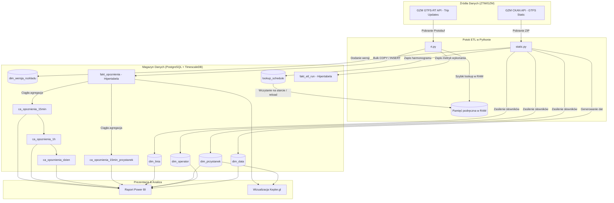
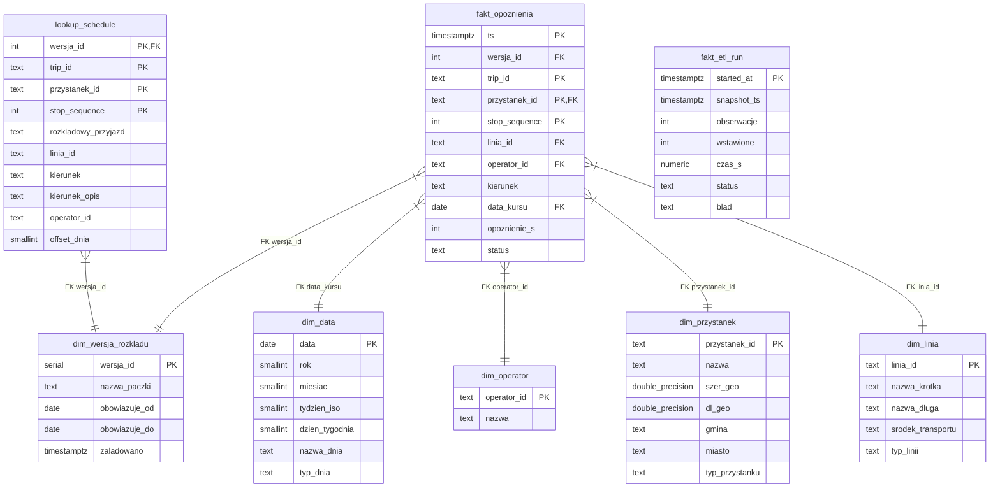
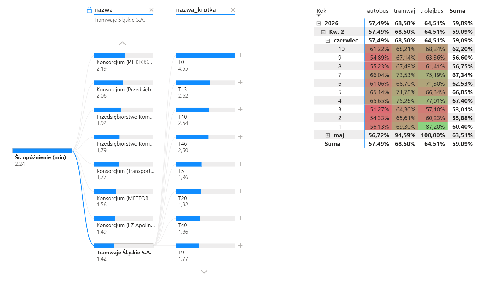

# GTFS OLAP

Projekt ten to magazyn danych oraz potok ETL stworzony z myślą o przetwarzaniu, składowaniu i analizie rzeczywistych opóźnień komunikacji miejskiej ZTM (Metropolia Śląska). Całość opiera się na dwóch strumieniach danych dostarczanych przez GZM: rozkładach jazdy (GTFS Static) oraz informacjach o pozycji i opóźnieniach pojazdów w czasie rzeczywistym (GTFS Realtime).

Zamiast prostego skryptu, który po prostu „zrzuca” dane do bazy, wdrożono tu pełnoprawną architekturę hurtowni danych zasilaną przez procesy w Pythonie, składowaną w bazie TimescaleDB (rozszerzenie PostgreSQL dla szeregów czasowych) i wizualizowaną w Power BI oraz Kepler.gl.

---

## Architektura systemu i przepływ danych

Zrozumienie przepływu danych w systemie ułatwia poniższy schemat. Pokazuje on drogę, jaką pokonuje informacja od momentu jej opublikowania przez serwery GZM, aż do prezentacji na wykresach:



---

## Model danych (Schemat gwiazdy)

Baza danych została zaprojektowana w klasycznym modelu gwiazdy. Pozwala to na intuicyjne i szybkie budowanie zapytań analitycznych – tabela faktów przechowuje jedynie liczby i klucze, a opisy znajdują się w tabelach wymiarów.



### Rola poszczególnych tabel
- **Wymiary (`dim_linia`, `dim_przystanek`, `dim_operator`, `dim_data`)**: Słowniki opisujące rzeczywistość. Wymiar `dim_data` to zasilany z góry kalendarz, który pozwala rozróżnić dni robocze od świąt czy niedziel niehandlowych na podstawie typów usług ZTM.
- **Wersjonowanie (`dim_wersja_rozkladu`)**: Rejestr paczek rozkładowych. Ponieważ rozkłady na Śląsku zmieniają się bardzo często, każda paczka otrzymuje unikalny klucz, chroniąc historyczne powiązania danych przed zatarciem.
- **Tabela dopasowań (`lookup_schedule`)**: Tabela techniczna, która przechowuje zdenormalizowany rozkład jazdy na potrzeby szybkiej weryfikacji w locie.
- **Fakty (`fakt_opoznienia`, `fakt_etl_run`)**: Surowe dane zbierane w czasie rzeczywistym. Druga z tabel służy do monitorowania kondycji samego procesu ETL (czas wykonania pętli, statusy, napotkane błędy). Obie są hipertabelami w TimescaleDB, co pozwala na bezbolesne zarządzanie dużymi zbiorami danych.

---

## Wyzwania inżynieryjne i decyzje projektowe

Wytworzenie stabilnego magazynu danych dla transportu publicznego wiąże się z koniecznością rozwiązania problemów, o których rzadko myśli się na początku drogi. Poniżej przedstawiono najważniejsze z nich wraz ze sposobem ich zaadresowania.

### 1. Częste zmiany rozkładów jazdy
ZTM GZM modyfikuje rozkłady jazdy niezwykle często – potrafią one obowiązywać tylko przez kilka dni (np. na czas objazdów czy świąt). Identyfikatory kursów (`trip_id`) zmieniają wtedy swoje znaczenie lub całkowicie znikają. Gdybyśmy po prostu nadpisywali rozkład w bazie, stare opóźnienia straciłyby powiązanie ze swoimi trasami i operatorami, stając się bezużytecznymi „sierotami”.
- **Rozwiązanie**: Wdrożono wersjonowanie rozkładów za pomocą tabeli `dim_wersja_rozkladu`. Static ETL przy każdym uruchomieniu pobiera paczki, tworzy nową wersję rozkładu i zapisuje ją w bazie. Nowe fakty są przypisywane do aktywnej wersji, podczas gdy stare rekordy na zawsze pozostają powiązane z wersją historyczną. Dzięki temu raporty historyczne zachowują pełną spójność.

### 2. Doba operacyjna i kursy nocne
W komunikacji miejskiej doba nie kończy się o 23:59. Autobus, który wyrusza w trasę w piątek o 24:30 (czyli 00:30 w sobotę), jedzie według piątkowego rozkładu jazdy. W danych GTFS godziny te są zapisywane jako wartości powyżej doby – np. `24:30` lub `26:15`. Zwykłe rzutowanie tego czasu na datę kalendarzową przypisałoby ten kurs do soboty, co zepsułoby analizę punktualności.
- **Rozwiązanie**: Podczas przetwarzania Static ETL wyliczany jest parametr `offset_dnia` (dla godziny 25:30 offset wynosi 1, a godzina w bazie to 01:30). Przy zapisie faktu opóźnienia rzeczywista data kursu (`data_kursu`) jest wyliczana jako `data_obserwacji - offset_dnia`. W ten sposób kurs nocny trafia do właściwego worka analitycznego (piątek), nie mieszając się ze statystykami weekendowymi.

### 3. Szybkie wyszukiwanie trasy w pamięci RAM
Strumień GTFS-RT (Trip Updates) jest odpytywany w pętli co 20 sekund. Każdy pobrany pakiet niesie około 1000 aktualizacji przystankowych. Chcąc sprawdzić w bazie planowany czas przyjazdu, linię i operatora dla każdego wpisu, musielibyśmy wykonać ponad tysiąc zapytań SQL w każdej iteracji.
- **Rozwiązanie**: Cały zdenormalizowany rozkład dla aktywnej wersji (ok. 1.4 miliona wierszy, zajmujący ok. 200 MB RAM) jest wczytywany do pamięci słownika Pythona przy uruchomieniu procesu RT ETL. Dzięki temu wyszukiwanie szczegółów kursu odbywa się w czasie O(1) bezpośrednio w pamięci procesu. Dodatkowo proces RT okresowo sprawdza wersję w bazie – jeśli Static ETL wgrał nowy rozkład, cache automatycznie się przeładowuje bez przerywania pętli.

### 4. Wydajny masowy zapis danych
Wykonywanie pojedynczych operacji `INSERT` dla tysiąca rekordów co 20 sekund szybko doprowadziłoby do zablokowania bazy danych. Dodatkowo ten sam zrzut danych z serwera GZM może zostać pobrany dwukrotnie, co wygenerowałoby błędy klucza głównego.
- **Rozwiązanie**: Zaimplementowano zapis masowy. Pobierany pakiet jest formatowany jako ciąg znaków CSV w pamięci podręcznej RAM (`io.StringIO`), przesyłany do bazy za pomocą komendy `COPY` do tymczasowej tabeli przejściowej, a następnie scalany z główną tabelą faktów jednym zapytaniem `INSERT INTO ... SELECT ... ON CONFLICT DO NOTHING`. Rozwiązuje to problem wydajności i eliminuje duplikaty.

### 5. Kosztowne obliczenia w locie (Agregaty ciągłe)
Próba wyliczenia punktualności z milionów surowych wierszy bezpośrednio podczas otwierania raportu Power BI skończyłaby się zawieszeniem narzędzia lub wielominutowym oczekiwaniem.
- **Rozwiązanie**: Wykorzystano agregaty ciągłe w TimescaleDB. Baza danych automatycznie i przyrostowo przelicza statystyki w tle, zapisując je w oknach 15-minutowych, godzinnych i dziennych. Raport Power BI łączy się tylko z tymi zmaterializowanymi widokami, co pozwala na błyskawiczne renderowanie wykresów.

### 6. Bezpieczeństwo i retencja danych
- **Klucze obce (FK)**: Relacje między tabelą faktów a słownikami są wymuszane przez silnik PostgreSQL, co gwarantuje spójność i brak "osieroconych" opóźnień.
- **Polityka usuwania**: Aby baza nie rosła w nieskończoność na dysku, wdrożono automatyczne usuwanie surowych faktów po 30 dniach i logów po 90 dniach. Dzięki agregatom ciągłym, historyczne dane statystyczne pozostają nienaruszone.

---

## Jak uruchomić projekt

### Krok 1: Uruchomienie bazy danych
Projekt wymaga bazy danych PostgreSQL z rozszerzeniem TimescaleDB. Najwygodniej uruchomić ją za pomocą Dockera:
```bash
docker compose up -d
```

### Krok 2: Przygotowanie środowiska Python
1. Stwórz i aktywuj wirtualne środowisko (venv):
   ```bash
   python -m venv .venv
   .venv\Scripts\Activate.ps1        # Windows (PowerShell)
   # lub
   source .venv/bin/activate          # Linux / macOS
   ```
2. Zainstaluj biblioteki w trybie deweloperskim (edytowalnym):
   ```bash
   pip install -e .
   ```

### Krok 3: Uruchomienie zasilania danymi
1. **Zasilenie słowników (Static ETL)** – wykonaj raz, aby pobrać rozkłady i zbudować tabele:
   ```bash
   python scripts/run_static_etl.py
   ```
2. **Pętla czasu rzeczywistego (RT ETL)** – proces ciągły, który odpytuje serwer o opóźnienia i zapisuje je w bazie:
   ```bash
   python scripts/run_rt_etl.py
   ```
   *Wskazówka: Możesz uruchomić pętlę jednorazowo (np. do testów) za pomocą flagi `--once`:*
   ```bash
   python scripts/run_rt_etl.py --once
   ```

---

## Wizualizacja i analiza

Zebrane dane można analizować na dwa sposoby:

### 1. Raport Power BI (`raport_gtfs_olap.pbix`)
Raport łączy się z bazą danych i pobiera dane z widoków agregacji ciągłej. Pokazuje ogólną punktualność metropolii, średnie opóźnienia wg linii/operatorów oraz najczęściej anulowane kursy.



### 2. Mapa Kepler.gl (`kepler.gl.html`)
Interaktywny widok mapy 3D, który pozwala zobaczyć rozkład opóźnień w przestrzeni geograficznej Śląska (np. wysokości słupków oznaczają średnie opóźnienie na danym przystanku).

